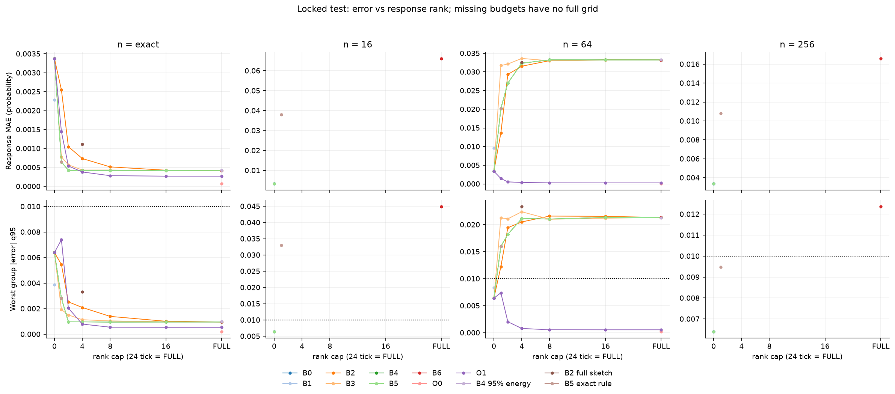
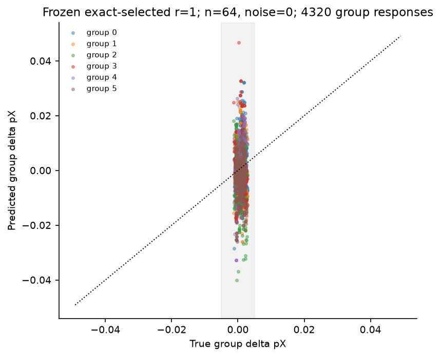
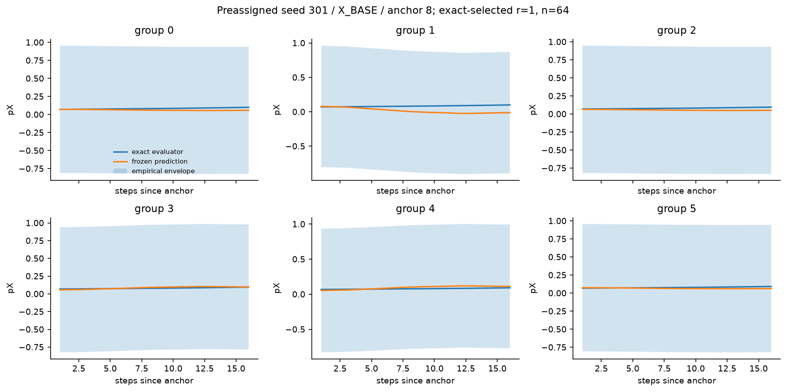
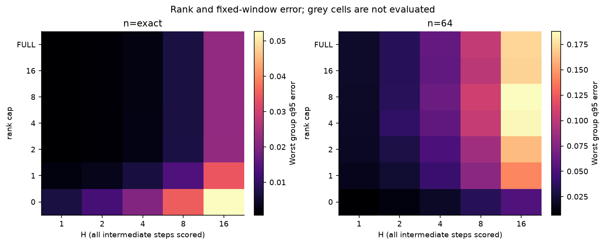
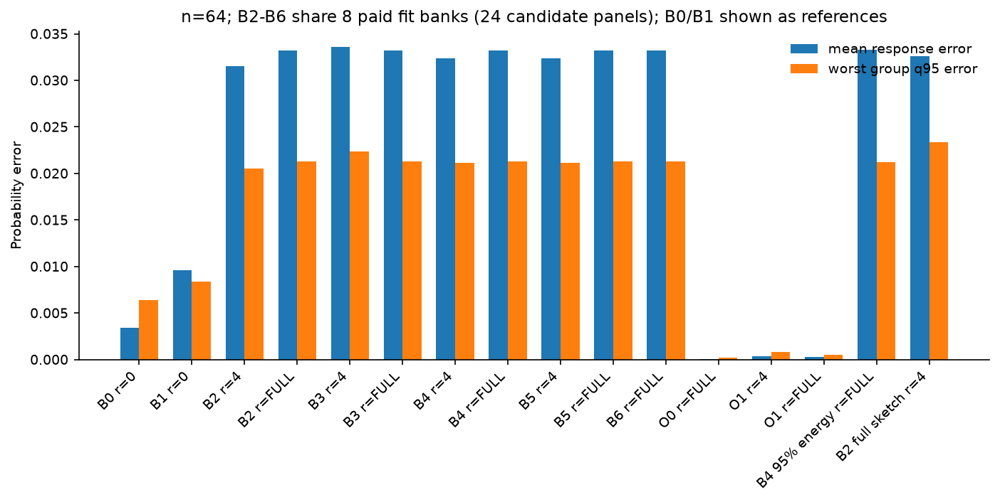

# CPU 建模实验结果（M0–M6）

## 实际范围

M2：60 条轨迹，11400 次 CPU Adam 更新，
203520 次训练/分支动作采样；完整采集耗时 25.8344 秒，
峰值 RSS 0.329971 GiB，输出 251487668 bytes。
同一轨迹供所有表示、基线、采样噪声和窗口分析。所有测试只覆盖固定数据集和固定初始化。

## 冻结基线结果

全部网格见 [完整汇总表](tables/M3_primary_aggregate_metrics.csv) 与
[逐 seed 结果](tables/M3_primary_by_seed.csv)。下表是预定基线/r=1/FULL 切片，数值均为概率单位。
公平主比较的 n64 统一使用噪声重复0–2；下一节冻结规则的稳健性比较使用0–4，因此两表n64汇总不必相等。
原始/投影、概率水平/响应指标分别存储；不以投影后的误差证明局部线性模型准确。

| 方法 | r cap | n | 响应 MAE | 响应 NRMSE | 最差群体 pX q95 | 最差群体 v q95 | 概率水平 MAE |
|---|---|---|---|---|---|---|---|
| B0_PERSISTENCE | 0 | exact | 0.00337903 | 1 | 0.00242706 | 0.006395 | 0.00337903 |
| B1_LOG_RIDGE | 0 | exact | 0.00228485 | 0.715899 | 0.00134389 | 0.00388203 | 0.00228485 |
| B2_RANDOM_Q | 1 | exact | 0.00254913 | 0.802528 | 0.00235314 | 0.00545517 | 0.00254913 |
| B2_RANDOM_Q | FULL | exact | 0.00041433 | 0.172137 | 0.000282491 | 0.000956182 | 0.00041433 |
| B3_UPDATE_PCA | 1 | exact | 0.00077785 | 0.312253 | 0.000393812 | 0.00193088 | 0.00077785 |
| B3_UPDATE_PCA | FULL | exact | 0.00041433 | 0.172137 | 0.000282491 | 0.000956182 | 0.00041433 |
| B4_RESPONSE_SVD | 1 | exact | 0.00064444 | 0.233398 | 0.000839457 | 0.00281857 | 0.00064444 |
| B4_RESPONSE_SVD | FULL | exact | 0.00041433 | 0.172137 | 0.000282491 | 0.000956182 | 0.00041433 |
| B5_WORST_GROUP_RANK | 1 | exact | 0.00064444 | 0.233398 | 0.000839457 | 0.00281857 | 0.00064444 |
| B5_WORST_GROUP_RANK | FULL | exact | 0.00041433 | 0.172137 | 0.000282491 | 0.000956182 | 0.00041433 |
| B6_FULL_Q_RIDGE | FULL | exact | 0.00041433 | 0.172137 | 0.000282491 | 0.000956182 | 0.00041433 |
| O0_FULL_J_ORACLE | FULL | exact | 7.23345e-05 | 0.0264279 | 7.85174e-05 | 0.000197519 | 7.23345e-05 |
| O1_JQ_SVD_ORACLE | 1 | exact | 0.00144712 | 0.460069 | 0.00168601 | 0.00739367 | 0.00144712 |
| O1_JQ_SVD_ORACLE | FULL | exact | 0.000269156 | 0.111716 | 0.000210343 | 0.000539383 | 0.000269156 |
| B4_ENERGY95 | FULL | exact | 0.000423639 | 0.173204 | 0.000307391 | 0.000986337 | 0.000423639 |
| B5_EXACT_SELECTED_DIAGNOSTIC | 1 | exact | 0.00064444 | 0.233398 | 0.000839457 | 0.00281857 | 0.00064444 |
| B0_PERSISTENCE | 0 | 64 | 0.00337903 | 1 | 0.00242706 | 0.006395 | 0.0315639 |
| B1_LOG_RIDGE | 0 | 64 | 0.00961438 | 2.53956 | 0.00657914 | 0.00835753 | 0.0328752 |
| B2_RANDOM_Q | 1 | 64 | 0.0136557 | 4.40698 | 0.0122237 | 0.00988257 | 0.0254625 |
| B2_RANDOM_Q | FULL | 64 | 0.0332113 | 8.53458 | 0.0213251 | 0.0183789 | 0.0129389 |
| B3_UPDATE_PCA | 1 | 64 | 0.0317177 | 8.16185 | 0.0212619 | 0.0181931 | 0.00927062 |
| B3_UPDATE_PCA | FULL | 64 | 0.0332113 | 8.53458 | 0.0213251 | 0.0183789 | 0.0129389 |
| B4_RESPONSE_SVD | 1 | 64 | 0.0201629 | 5.9998 | 0.0159548 | 0.0133801 | 0.0205984 |
| B4_RESPONSE_SVD | FULL | 64 | 0.0332113 | 8.53458 | 0.0213251 | 0.0183789 | 0.0129389 |
| B5_WORST_GROUP_RANK | 1 | 64 | 0.0201629 | 5.9998 | 0.0159548 | 0.0133801 | 0.0205984 |
| B5_WORST_GROUP_RANK | FULL | 64 | 0.0332113 | 8.53458 | 0.0213251 | 0.0183789 | 0.0129389 |
| B6_FULL_Q_RIDGE | FULL | 64 | 0.0332113 | 8.53458 | 0.0213251 | 0.0183789 | 0.0129389 |
| O0_FULL_J_ORACLE | FULL | 64 | 7.23345e-05 | 0.0264279 | 7.85174e-05 | 0.000197519 | 0.0314133 |
| O1_JQ_SVD_ORACLE | 1 | 64 | 0.00144712 | 0.460069 | 0.00168601 | 0.00739367 | 0.0314451 |
| O1_JQ_SVD_ORACLE | FULL | 64 | 0.000269156 | 0.111716 | 0.000210343 | 0.000539383 | 0.031416 |
| B4_ENERGY95 | FULL | 64 | 0.0332681 | 8.54732 | 0.0212465 | 0.0185661 | 0.0130207 |
| B5_EXACT_SELECTED_DIAGNOSTIC | 1 | 64 | 0.0201629 | 5.9998 | 0.0159548 | 0.0133801 | 0.0205984 |

## 精确选择的一维规则在有限采样中的检验

这条规则在 selection seeds 的 exact 视图中冻结，再在既有计数 n16/64/256×5 噪声上检验。
它不通过 locked-test 重新选择维数或 ridge；exact 选择需要 oracle 诊断信息，不能当成可部署选择器。

| 方法 | r cap | n | 响应 MAE | 响应 NRMSE | 最差群体 pX q95 | 最差群体 v q95 | 概率水平 MAE | 联合目标 |
|---|---|---|---|---|---|---|---|---|
| B5_EXACT_SELECTED_DIAGNOSTIC | 1 | exact | 0.00064444 | 0.233398 | 0.000839457 | 0.00281857 | 0.00064444 | WITHIN_MODEL_TOLERANCE |
| B5_EXACT_SELECTED_DIAGNOSTIC | 1 | 64 | 0.0205773 | 6.10336 | 0.0160562 | 0.0142278 | 0.0204356 | EXCEEDS_MODEL_TOLERANCE |
| B5_EXACT_SELECTED_DIAGNOSTIC | 1 | 16 | 0.0379581 | 11.6503 | 0.0330112 | 0.0270735 | 0.0419817 | EXCEEDS_MODEL_TOLERANCE |
| B5_EXACT_SELECTED_DIAGNOSTIC | 1 | 256 | 0.0108069 | 3.15079 | 0.00948016 | 0.00773067 | 0.0103824 | EXCEEDS_MODEL_TOLERANCE |

## 固定窗口

所有 H 都评分其中每一个中间时刻。经验误差带以 calibration seeds 的完整16步窗口×六群体最大误差校准，
在 test seeds 测覆盖，不是95%分布无关保证。净位移和路径方案使用同一个固定局部预测器。

| n | H | 响应MAE | NRMSE | pX q95 | v q95 | 最大达标H |
|---|---|---|---|---|---|---|
| 16 | 1 | 0.0360388 | 11.0738 | 0.0336689 | 0.0272145 | — |
| 16 | 2 | 0.0520045 | 10.6626 | 0.0504501 | 0.0366253 | — |
| 16 | 4 | 0.0839055 | 10.2583 | 0.0800057 | 0.060035 | — |
| 16 | 8 | 0.141363 | 9.9858 | 0.138209 | 0.108234 | — |
| 16 | 16 | 0.254679 | 10.4791 | 0.272042 | 0.203101 | — |
| 256 | 1 | 0.0106577 | 3.02629 | 0.00918279 | 0.00776488 | — |
| 256 | 2 | 0.0155371 | 2.91441 | 0.01392 | 0.0126761 | — |
| 256 | 4 | 0.0249111 | 2.81315 | 0.0244096 | 0.0209268 | — |
| 256 | 8 | 0.0419669 | 2.75459 | 0.0408219 | 0.0364954 | — |
| 256 | 16 | 0.0730918 | 2.77369 | 0.068994 | 0.0627398 | — |
| 64 | 1 | 0.0202076 | 5.84512 | 0.0164697 | 0.0149902 | — |
| 64 | 2 | 0.0294346 | 5.61418 | 0.0239926 | 0.0218163 | — |
| 64 | 4 | 0.0466555 | 5.38804 | 0.0399876 | 0.0343295 | — |
| 64 | 8 | 0.0767312 | 5.18786 | 0.0694209 | 0.0582583 | — |
| 64 | 16 | 0.132612 | 5.15678 | 0.119893 | 0.099487 | — |
| exact | 1 | 0.000616624 | 0.190193 | 0.000877975 | 0.00222191 | 4 |
| exact | 2 | 0.000977677 | 0.198105 | 0.00136482 | 0.00329777 | 4 |
| exact | 4 | 0.00192612 | 0.241785 | 0.0028488 | 0.00675259 | 4 |
| exact | 8 | 0.00440641 | 0.321611 | 0.00614212 | 0.0136733 | 4 |
| exact | 16 | 0.0109419 | 0.475227 | 0.013541 | 0.0338365 | 4 |

## 误差分解、消融和统计

方向遗漏、拟合/采样和非线性均有独立向量残差及三角界；不能用总范数相减分摊贡献。
完整数据见 [四级分解](tables/M3_four_level_error_decomposition.csv)、
[残差分解](tables/M3_error_decomposition.csv)、[辅助分支差异](tables/M3_auxiliary_minus_baseline.csv.gz)、
[方向误差](tables/M3_direction_accuracy.csv)。oracle残差向量原件保留于原始运行目录 M3_verified/oracle_decomposition_vectors。
表示 pooled/six_group/per_prompt、actual d/norm-only/SGD proxy、1/2/4/8 bank 的消融均复用同一 M2。
两个接口与全部分支按训练 RNG seed 成簇；10 个 locked-test seeds，5000 次探索性配对 cluster bootstrap。
噪声重复先在 seed 内汇总，不当作独立训练重复。

## 完整成本与盈亏平衡

[80行完整CPU成本表](tables/M4_cost_full_cpu_cost_allocated.csv) 同时列出校准、分支、计数采样、
I/O、拟合、刷新和跟踪开销，状态明确为 ALLOCATED_ESTIMATE_WITH_MEASURED_REPLAY。
计数和M2写盘实测总量分别为10.009154秒、8.159183秒；按配置分摊部分是估计，不能称为逐配置实测。
60次固定已有样本的读/拟合/预测/写入重放未新增训练或观测；真实Qwen秒数未知。
[bank预算收支表](tables/M4_cost_bank_budget_break_even_qualification.csv) 显示8 bank需25个面板单位，
超过最大测试窗口16；1/2/4 bank的抽象盈亏平衡H为4/7/13，但这些窗口的准确性尚未验证。

## 五张图

来源：`M3_primary_tables/primary_aggregate_metrics.csv + robust_aggregate_metrics.csv`。

来源：`M3_primary_tables/response_scatter.csv`。

来源：`M4/example_exact_selected_timeseries.csv`。

来源：`M4/tracking_rank_horizon_grid.csv`。

来源：`M3_primary_tables/primary_aggregate_metrics.csv + robust_aggregate_metrics.csv`。

## 验证和来源限制

实际测试回执见 [verification_summary.json](tables/verification_summary.json)。
新增模块94项及服务器155项针对性回归通过。服务器首轮完整回归失败记录保留；
本机完整适用回归在临时夹具输出触及2GiB时中断，日志记录1080通过、1项sealed检查排除。
中断XML另有一个无名未完成节点，旧回执计数器将其误计为通过；本报告采用日志1080。
因此工程总门禁为BLOCKED，完整回归待资源审阅；不得将这些部分回执拼成一次全套PASS。
M2 首次产物验证器因 JSON 角色键重排误报，修正后原数据完整通过，未重训。
M2 运行期间 collection 整文件加入只读验证/元信息而哈希发生变化；实际 toy 哈希不变，
训练和采样函数与哈希匹配的 smoke 原件 AST 一致；详见 M2_source_linkage.json。
M2 的完整运行时 collection 文本未独立归档，不能声称整文件在该次运行中保持不变。
之后阶段均额外保存执行前源码快照。首版 M3 保留，权威结果使用 stage_paths 指向的重跑：
明确 macOS Accelerate 单线程环境，并补齐已冻结 exact 规则的有限n稳健性；不增加训练或重新选阈值。
