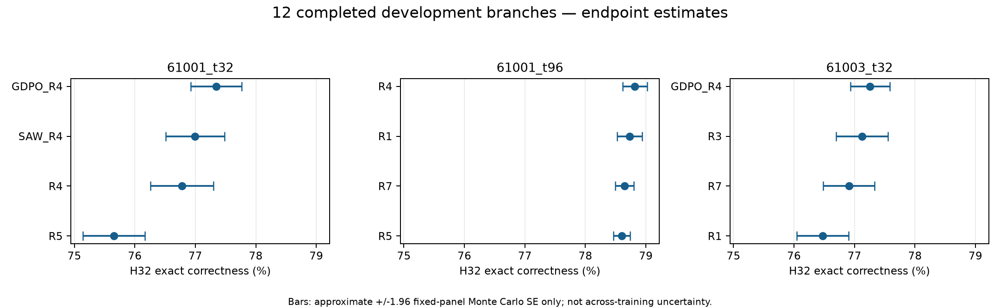
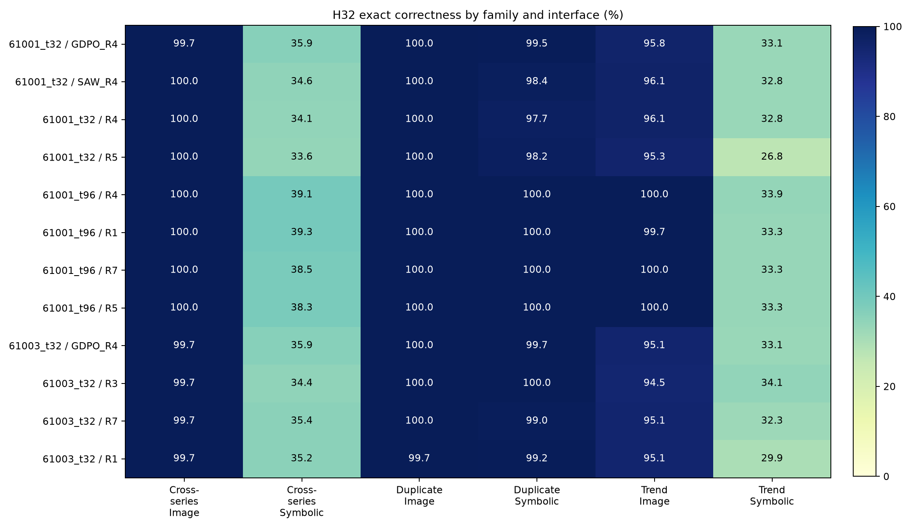

# 现有12个开发分支的数据分析

分析日期：2026-09-26。固定输入导出时间：05:46:04 UTC / 新加坡13:46:04。模型：Qwen3.5-9B。

**结论：这些数据已能说明局部奖励配方差异、主要错误位置，以及修复信息并非完全由奖励分数决定；还不能回答Z3能否在未见训练原点上选出更好的奖励。** 当前是开发数据的阶段性描述，不是最终测试，也不是首4条完整lineage交付。

## 1. 这12个究竟是什么

一个“分支”是从已经训练到某一时刻的模型及完整Adam状态出发，采用一个奖励方案继续训练32步，再做独立评估。12个分支并不是12条独立源轨迹。

| 训练原点 | 来源 | 已完成分支 |
|---|---|---|
| 61001_t32 | 第61001条源轨迹第32步，源配方R0 | R4、R5、GDPO_R4、SAW_R4 |
| 61001_t96 | 同一条61001源轨迹第96步 | R1、R4、R5、R7 |
| 61003_t32 | 第61003条源轨迹第32步，源配方R0 | R1、R3、R7、GDPO_R4 |

实际覆盖**2条独立源轨迹、3个原点、每个原点4个已完成分支**，每臂只有repeat 1。61001的两个原点相关，不能当成两条独立训练seed。现有12个中还没有R1源轨迹的分支。

同一原点的分支共享初始状态、登记的训练题序及评估面板；P前置样本供所有信息层共同使用。本次只读取已完成数据。各原点当前完成的配方子集不同，不能混合求“全局配方排名”，更不能据此给不同选择器分配不同候选集合。完整登记的R0–R7及外部基线保留，尚未完成的臂不删除。

数据量：384次训练更新、12,288条训练输出；H8诊断2,304条输出；H32主评估27,648条输出。每个H32分支使用144个提示、每提示16次采样，覆盖72个基础场景的两种接口、六个等权分层。另读取这3个原点的前后两个P窗口，共13,824条前置观测。后者不是额外训练seed。

配方简表：X奖励完整修复正确，A奖励下游答案正确，V奖励合法输出，C为关系满足比例。R0=2X；R1=2A；R3=2X+C；R4=2X+0.5V+0.5C；R5=2A+V；R7=2A+0.5V+0.5C。GDPO_R4使用R4优先权重并分别归一化奖励通道；SAW_R4使用R4优先权重做自适应加权。它们是外部基线，不等于Z3信息选择器。

## 2. 端点成绩：早期有差异，较晚原点几乎打平

J为六分层等权的完整修复正确率。图像/符号两列也是完整修复正确率；“单分支小时”是单GPU作业Slurm实际运行时长，不包括排队。

| 原点 | 配方 | J（%） | 图像接口（%） | 符号接口（%） | 单分支小时 |
|---|---|---:|---:|---:|---:|
| 61001_t32 | GDPO_R4 | 77.344 | 98.52 | 56.16 | 6.61 |
| 61001_t32 | SAW_R4 | 76.997 | 98.70 | 55.30 | 6.68 |
| 61001_t32 | R4 | 76.780 | 98.70 | 54.86 | 6.66 |
| 61001_t32 | R5 | 75.651 | 98.44 | 52.86 | 6.33 |
| 61001_t96 | R4 | 78.819 | 100.00 | 57.64 | 6.39 |
| 61001_t96 | R1 | 78.733 | 99.91 | 57.55 | 7.78 |
| 61001_t96 | R7 | 78.646 | 100.00 | 57.29 | 6.15 |
| 61001_t96 | R5 | 78.602 | 100.00 | 57.20 | 7.93 |
| 61003_t32 | GDPO_R4 | 77.257 | 98.26 | 56.25 | 7.64 |
| 61003_t32 | R3 | 77.127 | 98.09 | 56.16 | 7.67 |
| 61003_t32 | R7 | 76.910 | 98.26 | 55.56 | 7.60 |
| 61003_t32 | R1 | 76.476 | 98.18 | 54.77 | 7.64 |

图中横线是固定模型、固定题目面板条件下的近似采样误差范围：估计值±1.96×Monte Carlo标准误。**它不包含重新训练、换源轨迹或换评估题目带来的不确定性。** 每题只有16次采样，观测全对/全错不代表真实概率确定为1/0。

- **61001_t32：**已完成臂最好GDPO为77.344%，最差R5为75.651%，相差1.693个百分点。固定R4比R5高1.128个百分点。这里存在值得研究的局部选择空间。
- **61001_t96：**四臂最大差只有0.217个百分点；R4与R5在144个提示中的142个上，观测正确率完全相同。当前这组配方在这个端点上几乎打平，尚不能声称动态选奖励能带来可观收益。
- **61003_t32：**GDPO为77.257%，R3为77.127%，只差0.130个百分点；GDPO与R1差0.781个百分点。GDPO虽然在两个早期原点的已完成子集中居首，但缺臂、单次训练以及很小的部分差距均不支持“GDPO普遍最好”。

同一lineage的R4−R5差距从t32的1.128个百分点缩小到t96的0.217个百分点，但两处都是R4更高，**还没有观察到这对共同配方的优劣反转**。配方效果差距随状态变化，不等于已经证明最优配方需要随状态改变。

### 差异有多大、采样误差有多大

以下全部为百分点。仅作探索性误差描述，未校正多重比较；不要把“区间未跨0”当成跨训练原点的显著性结论。

| 同原点比较 | J差值 | 近似条件采样范围 |
|---|---:|---:|
| 61001_t32：GDPO−R4 | +0.564 | [−0.105, +1.234] |
| 61001_t32：R4−R5 | +1.128 | [+0.399, +1.858] |
| 61001_t96：R4−R5 | +0.217 | [−0.031, +0.465] |
| 61003_t32：GDPO−R3 | +0.130 | [−0.407, +0.668] |
| 61003_t32：GDPO−R1 | +0.781 | [+0.243, +1.319] |

计算方式：各提示成功率为p̂，每提示n=16，单端点均值方差估计为Σ[p̂(1−p̂)/(n−1)]/144²。两个分支使用各自独立的评估随机流，因此差值方差相加；没有把不同分支的第k次输出误作配对样本。题目对齐用于逐题差异诊断。两个已完成源轨迹不足以给出可信的跨lineage泛化区间，此处不强行计算。

## 3. 总分掩盖了一个集中的瓶颈

12个分支的图像接口正确率为98.09%–100%；符号接口为52.86%–57.64%。进一步拆分，**95.49%–100%的完整修复错误集中在符号接口的cross_series与trend两类任务**。符号接口的duplicate_encoding多数已接近满分。

因此，约77%–79%的总分并不意味着所有任务都学到七八成：它混合了已经很高的分层和仍然很弱的两类分层。后续分析的辨别力主要来自这两个弱项，而非再提高已经接近满分的部分。此发现描述瓶颈位置，没有证明瓶颈究竟源于表示、推理、探索还是训练目标。

例如61001_t32的GDPO−R5总分差1.693个百分点，其中符号trend从26.823%到33.073%，在六层平均后贡献1.042个百分点，约占总差的61.5%。这不是各分层均匀改善。

### “更合法、局部更对”不一定等于“整个修复正确”

在61001_t32：

| 指标 | R4 | R5 |
|---|---:|---:|
| 完整修复正确率 | 76.780% | 75.651% |
| 平均坐标正确率 | 88.118% | 89.583% |
| 非法输出率 | 2.865% | 0.998% |

R5的合法性和平均坐标正确率更好，完整修复正确率反而更低。因此不能只看合法率或局部准确率就宣布某个奖励方案更好。这个例子揭示指标之间的取舍，不能证明是哪一个奖励分量单独造成差异：R4与R5同时改变了多个权重。

事件定义：X=完整修复正确；S=下游答案正确但完整修复错误；W=输出合法但下游答案错误；I=非法。CSV同时保留S/W/I比例。平均坐标正确率将非法输出计0；damage_probability是“输出合法且破坏至少一个原本正确坐标”的无条件概率，非法率另列，不把非法输出的F/B/M当0。

## 4. 较晚原点为何难以拉开差距：训练记录给出的线索

在61001_t96，32个更新中，记录的梯度范数严格等于0的步数为21–25。每步4组、每组8个输出；至少包含一个非零优势值的组占比如下：

| 配方 | 非零优势组比例 | 零梯度步数 |
|---|---:|---:|
| R4 | 8.59% | 21/32 |
| R1 | 5.47% | 25/32 |
| R7 | 9.38% | 21/32 |
| R5 | 7.81% | 22/32 |

结合端点近乎打平，这支持一个待验证解释：在这些较晚状态上，现有采样与奖励产生的组内区分信号较稀疏。它不是“模型已达到理论上限”或“额外训练无效”的证明。

**零梯度不等于参数不更新。** 完整Adam恢复保留动量，即使当前梯度为0，优化器更新仍可能改变参数；本分析不建议跳过这些步骤或改恢复规则。GDPO有额外批次归一化，精确浮点非零计数还可能受微小偏移影响，故没有用其非零组比例与其他算法直接比较“学习信号强弱”。CSV的nonzero_advantage_group_fraction只保留原始定义的计数。

H8与H32的完整评估面板大小不同，直接相减容易误导。我们只对齐共同的24个提示：61001_t32各臂H8→H32变化为+2.865至+5.729个百分点；61003_t32为+1.823至+4.948个百分点；61001_t96为−0.260至0。每题H8采8次、H32采16次，仍有采样误差。这是小面板诊断，不是相对未续训起点的净收益估计；也不能把P面板的前置成绩与D面板端点相减当训练收益。

## 5. 概率表示方面：额外修复信息存在，但决策价值尚未证明

本次做一个直接审计：固定提示，按完整奖励向量(X,A,V,C)分组，查看同一奖励组内是否出现不同的修复结构(F,B,M)。F表示是否修好原错误坐标；B表示破坏多少原本正确坐标；M表示总共改动多少坐标。I非法输出保持缺失，不纳入有效修复分组。

下面只列当前原点的P窗口；前一窗口的完整表在CSV中。混合组指同一提示、同一奖励向量下出现至少两种(F,B,M)。

| 原点 | P窗口 | 存在混合组的提示 | 混合组/至少两次观测的组 | 同奖励输出对的结构不一致率 |
|---|---:|---:|---:|---:|
| 61001_t32 | 32 | 35/72 | 60/148 | 6.15% |
| 61001_t96 | 96 | 10/72 | 10/84 | 0.74% |
| 61003_t32 | 32 | 32/72 | 54/142 | 5.27% |

“输出对”是同组内两两组合的计数，组越大权重越高，**不是独立样本数，也不是互信息估计或统计检验**。原始单例组和组样本量已保留；每提示32次不能精确估计所有条件分布。

一个可核对的例子：61001_t32的P t32中，提示`6763f441e7c1014393c869ecc597c0f6223544b3c4af739a5232da24fa482dba`有29个输出的奖励均为[0,0,1,2/3]，但修复结构如下：

| (F,B,M) | 次数 | 含义 |
|---|---:|---|
| (0,0,0) | 9 | 没修好，也没改动 |
| (0,0,1) | 14 | 改了一处，但仍没修好；未破坏原本正确的坐标 |
| (0,3,3) | 1 | 未修好，并破坏三个原本正确坐标 |
| (0,3,4) | 5 | 未修好，破坏三个原本正确坐标，总共改动四处 |

**这给出了“相同奖励向量对应不同修复结构”的实际反例。** 只凭该奖励向量和提示，无法确定具体这一次输出属于哪种修复结构。它说明额外结构有观察上的内容，但不证明有限样本下能稳定估计它，更不证明它能预测哪个奖励配方的后续收益更高。

61001较晚窗口的不一致比例降到0.743%，低于t32的6.153%；这说明在该lineage的这批观测中，额外结构变化更少。该比例受奖励组占比影响，不能单凭它断言条件信息消失，也不能把它当成端点打平的因果解释。

与研究顺序对应：**目前拿到了“结构不完全重复”和“局部奖励响应”的部分证据；尚缺“用结构提前做选择并在新原点上获益”的证据。** 本分析没有确定概率云的最佳几何形式，没有验证它是充分状态，也没有验证完整动力学模型。

## 6. 实测成本与现阶段能回答的问题

12个分支累计85.0825 GPU小时，均值7.0902小时，范围6.153–7.926小时。其中训练记录合计58.2005小时，H32独立评估采样24.2802小时，其余约2.6018小时包含H8、加载及作业其他开销。以上不包括源轨迹、前置观测、旧E评估、排队或维护停机。五卡全部持续可用时，85.08/5≈17.02小时仅是这12个分支的理想算力折算，不是实际日历耗时或后续完成承诺。

| 问题 | 本批证据能否回答 |
|---|---|
| 部分奖励配方在同一原点产生不同端点吗？ | 有局部描述性差异；重复训练不确定性尚未测全 |
| 修复结构是否完全由单次完整奖励向量决定？ | 已见反例，不能完全决定 |
| 较晚原点是否一定仍有很大选择空间？ | 当前四臂接近，不支持该假设；其他未完成臂未知 |
| 最优奖励是否必须随状态改变？ | 未证实；共同R4/R5没有排名反转 |
| Z3是否优于完整奖励统计Z2？ | 未知，尚无冻结选择器的新原点比较 |
| 是否优于BestStatic、SAW/GDPO、DIRECT_REPAIR？ | 未知；固定配方矩阵、基线与选择器比较不完整 |
| 概率云最佳建模形式是否已确定？ | 没有，本批只审计当前变量并描述奖励响应 |

本批每个原点都还缺完整R0基准及DIRECT_REPAIR，不能推断这些续训奖励相对维持原奖励的提升。首四条完整lineage的88个分支仅完成其中12个，不能据此放行后续开发扩展门禁。不会因这次排序删臂、换seed、改变目标或预跑最终测试。后续仍按原方案补齐开发响应，检验额外信息的增量预测/选择价值，冻结规则后再做未见原点前瞻测试。

## 7. 数据、复现与核验

本报告由既有服务器原始输出提取，未启动新GPU实验，未拟合选择器。原始文本、完整Adam检查点、失败attempt及独立评估仍保存在服务器，不由这个小型分析包替代。

- [analysis_input.json](analysis_input.json)：12分支逐提示事件计数、训练更新摘要、6个P窗口的精确奖励/修复联合计数，附4份既有核验回执。
- [branch_summary.csv](branch_summary.csv)：12个端点的分数、错误结构与耗时。
- [six_strata.csv](six_strata.csv)：72行分层结果。
- [within_origin_comparisons.csv](within_origin_comparisons.csv)：18对同原点差值及条件采样误差。
- [aligned_H8_H32.csv](aligned_H8_H32.csv)：12行同24提示的H8/H32比较。
- [prestate_information_audit.csv](prestate_information_audit.csv)：6个P窗口的冗余审计计数。
- [training_updates.csv](training_updates.csv)：384步训练摘要。
- [analyze.py](analyze.py)与[extract.py](extract.py)：可复现分析和固定范围只读提取脚本。
- 图表同时提供PNG和可导出PDF：[分数图](endpoint_scores.pdf)、[分层图](strata_heatmap.pdf)。

服务器根：`/projects/varunssd/louis-ssvc/prospective_selection_v2_20260924`。分支原件在`campaign/branches/<origin>/<recipe>/repeat_1/`，前置观测在`campaign/prestate/<origin>/`。生产运行快照e59b9ee保持原样，本次只增加离线分析。

离线复现（在本目录）：`python analyze.py`，使用Python 3.12、NumPy 2.5.2、Matplotlib 3.11.1。服务器提取：`python extract.py --root <服务器根> --out <新的输出文件>`；输出文件须不存在，避免覆盖原件。

已核验：12个分支的既有完成回执；提取时的面板身份、唯一采样ID和行数；144提示/72场景及事件总和；J与已保存summary一致；条件采样标准误与原评估summary一致；H8/H32提示身份对齐；每分支32步。沿用此前原始绑定核验，不重哈希9B模型。分析脚本通过针对性静态检查及CPU执行，图表已检查排版。
